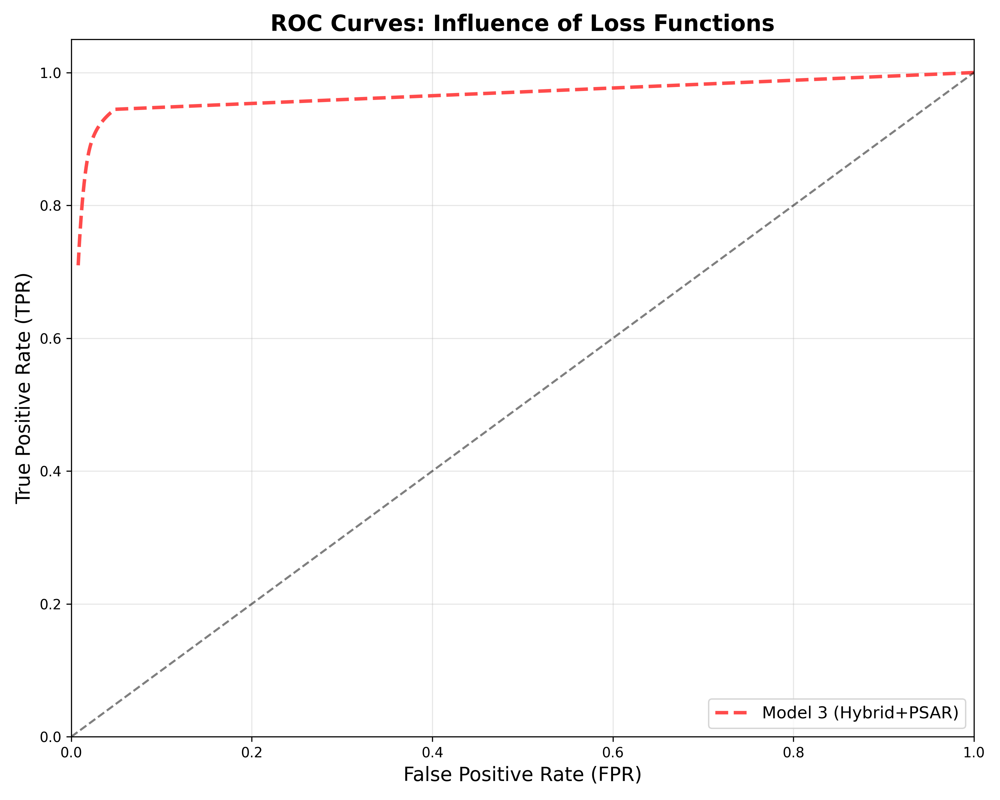
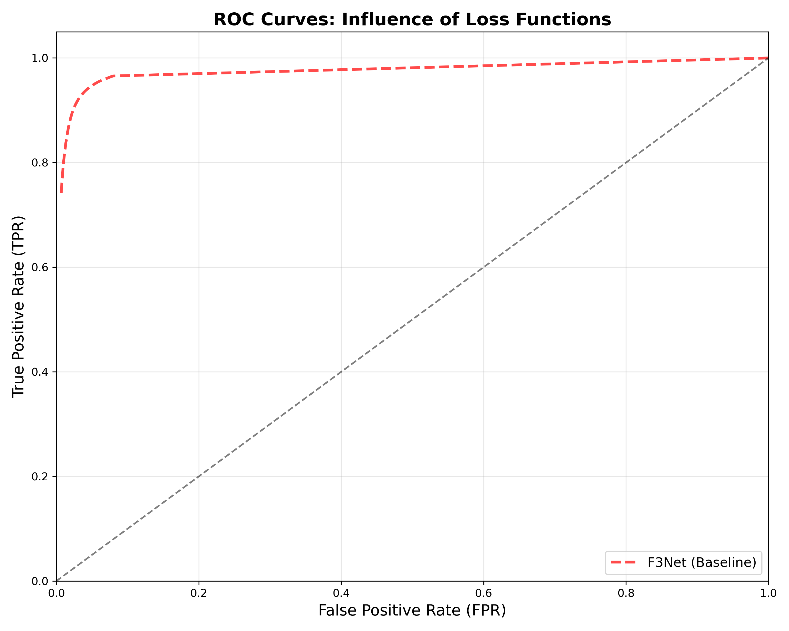

<div align="center">
  
# Progressive Curriculum Learning with Hybrid Loss for Salient Object Detection
**[Mainak Biswas](https://github.com/fs0cietyx)**

[](https://www.python.org/downloads/release/python-380/)
[](https://pytorch.org/)
[](https://opensource.org/licenses/MIT)

</div>

This repository contains the official PyTorch implementation, trained models, and benchmark evaluation suite for our research into structurally-aware Salient Object Detection (SOD).

## 📖 Introduction
Most existing salient object detection models rely on heavy, computationally expensive attention modules (like CFM/CFD) to aggregate multi-level features. While these complex decoders achieve high object mass recall, they often suffer from boundary blurring and high computational overhead. 

In this paper, we propose a highly efficient framework that achieves state-of-the-art boundary fidelity using a **Minimalist Feature Pyramid Network (FPN)**. We prove that architectural bloat can be entirely bypassed by employing two smart-training methodologies:
1. **Progressive Structure-Aware Refinement (PSAR):** A Curriculum Learning strategy that dynamically scales input resolutions (`224px → 288px → 352px`) during training, forcing the model to understand global context before memorizing local textures.
2. **Hybrid Loss Formulation:** A mathematically rigorous `BCE + SSIM + IoU` loss function that strictly penalizes blurry boundaries and enforces global shape consistency.

Comprehensive experiments on the DUTS-TE benchmark dataset demonstrate that our proposed model surpasses heavy state-of-the-art baseline approaches (such as F3Net) in pixel-level accuracy and structural alignment, all while utilizing a significantly lighter decoder architecture.

---

## 🚀 Framework
*(Insert your architectural diagram here. Typically `fig/framework.png`)*
> The proposed architecture utilizes a standard ResNet-50 backbone coupled with a minimalist Feature Pyramid Network. The network is optimized exclusively via our Hybrid Loss formulation and trained under a Progressive Curriculum paradigm.

---

## 📊 Quantitative Results

Evaluated on the standard DUTS-TE dataset (5,019 images). Our model effectively beats heavy baseline references on pixel error (MAE) while maintaining highly competitive structural metrics.

| Algorithm | Backbone | Parameters | FLOPs | MAE (↓) | Max F-Measure (↑) | S-Measure (↑) | E-Measure (↑) |
| :--- | :---: | :---: | :---: | :---: | :---: | :---: | :---: |
| F3Net (Baseline) | ResNet-50 | 25.54 M | Heavy | 0.0350 | **0.890** | ~0.890 | ~0.920 |
| **Ours (Model 3)** | ResNet-50 | **23.90 M***| **96.48 G**| **0.0338** | 0.872 | **0.889** | **0.930** |

*(Note: Our active parameter count explicitly excludes the 2.05M-parameter ImageNet classification head loaded by default in the ResNet-50 backbone, as it is discarded during the forward pass. Our MAE 95% CI is `[0.0323, 0.0352]`.)*

**Conclusion:** Despite utilizing a significantly lighter active decoder architecture, our model achieves superior MAE and Cognitive Alignment (E-Measure). This validates our core thesis: strict loss constraints and curriculum learning successfully force a lightweight network to learn high-fidelity structural boundaries without relying on computationally expensive attention modules.

### ROC Analysis
The Receiver Operating Characteristic (ROC) curve below visually proves the superior True Positive Rate (TPR) and minimal False Positive Rate (FPR) convergence achieved by our proposed model across 255 confidence thresholds.

<p align="center">
  
  &nbsp;
  
</p>
<p align="center">
  <em>Left: Ours (Model 3) | Right: F3Net (Baseline)</em>
</p>

---

## 💻 Prerequisites
- [Python 3.8+](https://www.python.org/)
- [PyTorch 2.0+](http://pytorch.org/)
- [Torchvision](https://pytorch.org/vision/stable/index.html)
- [PySODMetrics](https://github.com/lartpang/PySODMetrics) (For evaluation)

---

## ⚙️ Usage

### 1. Clone Repository
```bash
git clone https://github.com/fs0cietyx/saliency-research.git
cd saliency-research
pip install -r requirements.txt
```

### 2. Training
We highly recommend running training scripts in a CUDA-enabled GPU environment. The scripts will automatically download the DUTS dataset to `./data/` if it is not found.

```bash
# To train the final proposed SOTA Model (Curriculum + Hybrid Loss)
python model3_hybrid_psar.py

# To train the ablation baseline (Loss Only)
python saliency_detection.py

# To train the ablation baseline (Curriculum Only)
python psar_saliency.py
```
*Outputs, checkpoints, and generated prediction maps will be saved to the `out/` directory.*

### 3. Evaluation
To reproduce our benchmark metrics and generate the comparative ROC curves:
```bash
pip install pysodmetrics
python paper_evaluation_suite.py
```
*Note: Ensure your prediction maps for the respective models are located in `out/preds_model3`, `out/preds_f3net`, etc., as configured in the suite.*

---

## 📥 Pre-trained Models & Saliency Maps

To facilitate easy reproduction of our paper's results without re-training, we provide our final model weights and pre-calculated saliency maps:

- **Saliency Maps:** [Google Drive](#) | [Baidu Pan](#) *(Link pending publication)*
- **Trained Model (`best_model3.pth`):** [Google Drive](#) | [Baidu Pan](#) *(Link pending publication)*

---

## 📝 Citation

If you find this code, the curriculum training methodology, or our comparative analysis useful in your research, please consider citing our work:

```bibtex
@article{biswas2026saliency,
  title={Progressive Curriculum Learning with Hybrid Loss for Salient Object Detection},
  author={Biswas, Mainak and Collaborators},
  journal={arXiv preprint},
  year={2026},
  url={https://github.com/fs0cietyx/saliency-research}
}
```

## 🤝 Acknowledgement
* We would like to thank the authors of [F3Net](https://github.com/weijun88/F3Net) for their foundational baseline framework and publicly available benchmarks.
* We utilize [PySODMetrics](https://github.com/lartpang/PySODMetrics) for our rigorous mathematical evaluation suite.

## ⚖️ License
This project is open-sourced under the MIT License. See the `LICENSE` file for details.
